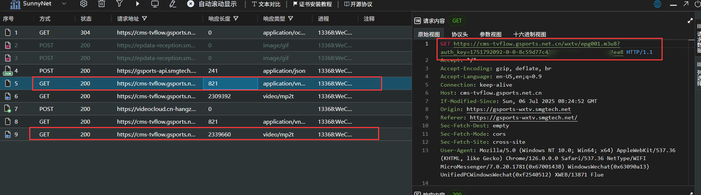

# Five Star Sports Stream

Watch Five Sports Stream as you like 😉

肆意观看五星体育频道直播而不受限制

[](https://github.com/cworld1/five-star-stream/blob/main/LICENSE)

## Introduction 介绍

### 准备

1. 一台能运行程序的设备（Windows 端我已打包好，其他平台需要自己配置项目）
2. 一台在同一网络下的能播放视频的设备（还是同一台电脑就挺好）
3. 一台有安装抓包工具、微信的设备（当然也可以是同一台电脑；不会解决自动获取 `auth_key`，希望有大佬来做贡献）

### 抓包

1. 打开微信五星体育官方公众号提供的在线播放地址

   或者将这里我已经拷贝出来的地址，复制到微信中打开： https://gsports-wxtv.smgtech.net/tv?id=11

2. 点击播放，确保网页已经在获取有关内容

3. 打开你的抓包工具，启动并抓取几秒钟

   注：印象里 Android 最难，作者懒得测试了，有成功的朋友可以开 Issue 分享。其他平台抓包方法工具千奇百怪，建议自己网上搜一个靠谱简单的视频。不需要抓包内容，所以可能不存在 HTTPS 有关加密问题的涉及。

4. 找到 M3U8 文件请求（见下图 1）。特征：

   - 每隔几秒钟十几秒时间就会请求一次
   - 不重新加载的情况下不会变更链接
   - 地址为 https://cms-tvflow.gsports.net.cn/wxtv/epg001.m3u8?auth_key=xxx
   - GET 请求
   - 长度为 821
   - 响应类型声明为 `application/vnd.apple.mpegurl`
   - 内容为 `#EXTM3U \n #EXT-X-VERSION:3 ...`

5. 你只需要拷贝请求地址 `https://cms-tvflow.gsports.net.cn/wxtv/epg001.m3u8?auth_key=xxx`（见下图 1 右侧）。



### 启动服务器

该步骤正是这个项目要做的。由于网页设置了一些诸如 “防盗链” 等机制，所以需要项目搭建服务器去中转请求。

~~抓包只需要现成软件运行就可以了，而启动服务器需要考虑的就很多了，怎么下载软件，怎么双击运行（bushi）~~

1. 获取程序。你可以：

   - 直接使用我打包好的（目前只提供 Windows 版本）
   - 或者自己配置项目（后文会讲）

2. 运行它。

### 启动直播流

打开你喜欢的直播流程序，然后键入：

`http://localhost:5623/<你抓包的地址>`

如：`http://localhost:5623/https://cms-tvflow.gsports.net.cn/wxtv/epg001.m3u8?auth_key=xxxxxxxxxxxxx`

项目也支持精简地址如：`http://localhost:5623/epg001.m3u8?auth_key=xxxxxxxxxxxxx`

局域网内跨设备访问请将 localhost 改为对应 IP 地址。可能需要配置防火墙放行。

## FAQ

> - 问：一次抓包能用多久？
> - 答：昨晚抓包，第二天下午看好像就不行了

> - 问：这么短有什么用？
> - 答：看版权节目内容

> - 问：支持什么车队？
> - 答：窝法乙烷

## Development

Requirement:

- Python: 3.8+

Make sure to install dependencies:

```bash
python -m venv
source ./.venv/Scripts/activate.*
python -m pip install -r requirements.txt
# Or for uv
uv sync
```

Then start it:

```bash
python ./main.py
# Or for uv
uv run ./main.py
```

## Production

Build the application for production:

```bash
uv run nuitka --follow-imports --onefile ./main.py
```

Check out the [deployment documentation](https://github.com/Nuitka/Nuitka#tutorial-setup-and-build-on-windows) for more information.

## Contributions

To spend more time coding and less time fiddling with whitespace, this project uses code conventions and styles to encourage consistency. Code with a consistent style is easier (and less error-prone!) to review, maintain, and understand.

## License

This project is licensed under the GPL-3 License.
